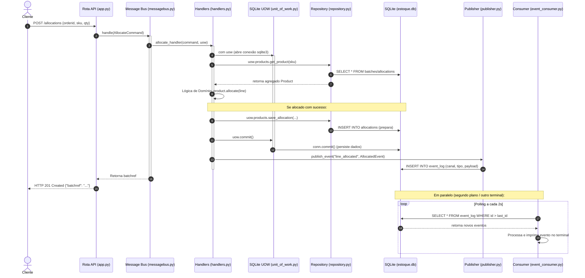

# Guia Definitivo de Estudos: Prova Prática e Arguição de APOO (Arquitetura SQLite + Event Log)
*Foco: Arquitetura Orientada a Eventos em Python (SQLite puro, DDD, Message Bus, Transactional Outbox e CQRS)*

---

## 1. Fluxo de Execução da Aplicação (Comunicação Assíncrona e Outbox)

Esta arquitetura utiliza o padrão **Transactional Outbox** (Event Log) e um **Consumidor por Polling**. O fluxo de execução de uma alocação de pedido (`POST /allocations`) funciona da seguinte forma:



---

## 2. Perguntas e Respostas da Arguição (50% da Nota)

### Q1: Como funciona o padrão Transactional Outbox (Log de Eventos) nesta arquitetura?
*   **Resposta:** É um padrão que garante a consistência atômica entre a alteração de dados da aplicação e o disparo de eventos de integração. Em vez de enviar uma mensagem por rede no meio da transação do banco (o que pode falhar e travar o banco), nós salvamos o evento na tabela `event_log` do próprio SQLite na mesma transação/operação de persistência. Um processo separado (`event_consumer.py`) lê essa tabela e processa os eventos em segundo plano.

### Q2: Qual o papel do `sqlite3.Row` na conexão com o banco de dados?
*   **Resposta:** Por padrão, o SQLite no Python retorna resultados de consultas como tuplas ordenadas (ex: `("batch-001", "CHAIR")`), obrigando-nos a usar índices numéricos (`row[0]`). Definindo `conn.row_factory = sqlite3.Row`, o SQLite retorna os dados mapeados como dicionários. Isso permite acessar os dados pelas chaves com os nomes das colunas físicas (`row["ref"]`, `row["sku"]`), tornando o código do repositório legível e menos sujeito a erros de indexação.

### Q3: Como é feita a reconstrução do Agregado (Domain Aggregate) no Repositório SQLite?
*   **Resposta:** Diferente de ORMs como o SQLAlchemy, no SQLite puro nós mapeamos os dados manualmente. No método `get_product(sku)` em `repository.py`:
    1. Buscamos todas as linhas de lotes da tabela `batches` por SKU.
    2. Instanciamos a classe de domínio `Product(sku)`.
    3. Para cada lote encontrado, buscamos suas respectivas alocações na tabela `allocations`.
    4. Adicionamos as linhas de pedido (`OrderLine`) ao `set()` de alocações do lote correspondente.
    5. Adicionamos o lote (`Batch`) ao agregado do produto.
    6. Retornamos o produto reconstruído para que o handler aplique a lógica de negócios pura do domínio.

### Q4: Para que serve o `bootstrap.py` e por que usamos o `partial` da biblioteca `functools`?
*   **Resposta:** O `bootstrap.py` serve para inicializar a infraestrutura da aplicação (como instanciar o Unit of Work) e injetar essa dependência de forma limpa nos manipuladores (handlers). Usamos `partial` para pré-configurar os handlers associando o parâmetro `uow` a eles. Assim, o `MessageBus` pode chamar os handlers de forma uniforme (ex: `handler(command)`) sem precisar conhecer os detalhes do `UnitOfWork` ou de infraestrutura de banco de dados.

### Q5: O que é o Read Model (read_model.py) e por que ele acessa o banco diretamente sem usar o repositório?
*   **Resposta:** Ele representa a separação de responsabilidades de Consulta (Queries) e Escrita (Commands) do CQRS. Enquanto a escrita passa por toda a validação complexa do domínio e repositório para manter a consistência, a leitura (`GET /allocations`) não precisa de regras de negócio. O `read_model.py` executa uma consulta SQL direta (`SELECT`) na tabela `allocations` e retorna dicionários brutos direto para a API Flask, otimizando o desempenho do sistema.

---

## 3. Testando a API via PowerShell (35% da Nota)

Estes comandos utilizam a porta padrão `5000` da API Flask e os parâmetros do projeto de exemplo:

### 1. Testar Rota Inicial (GET)
```powershell
Invoke-RestMethod -Method Get -Uri "http://127.0.0.1:5000/"
```

### 2. Criar Lote (POST)
```powershell
$body = @{
    ref = "batch-001"
    sku = "CHAIR"
    qty = 100
} | ConvertTo-Json

Invoke-RestMethod -Method Post -Uri "http://127.0.0.1:5000/batches" -ContentType "application/json" -Body $body
```

### 3. Listar Lotes (GET)
```powershell
Invoke-RestMethod -Method Get -Uri "http://127.0.0.1:5000/batches"
```

### 4. Buscar Lote Específico (GET com Filtro)
```powershell
Invoke-RestMethod -Method Get -Uri "http://127.0.0.1:5000/batches/batch-001"
```

### 5. Atualizar Lote (PUT)
```powershell
$updateBody = @{
    qty = 150
} | ConvertTo-Json

Invoke-RestMethod -Method Put -Uri "http://127.0.0.1:5000/batches/batch-001" -ContentType "application/json" -Body $updateBody
```

### 6. Alocar Pedido (POST)
```powershell
$allocBody = @{
    orderid = "order-001"
    sku = "CHAIR"
    qty = 10
} | ConvertTo-Json

Invoke-RestMethod -Method Post -Uri "http://127.0.0.1:5000/allocations" -ContentType "application/json" -Body $allocBody
```

### 7. Testar Erro de SKU Inválido (Regra de Negócio de Validação)
```powershell
$errorBody = @{
    orderid = "order-002"
    sku = "TABLE"  # SKU inexistente para forçar erro 400
    qty = 10
} | ConvertTo-Json

try {
    Invoke-RestMethod -Method Post -Uri "http://127.0.0.1:5000/allocations" -ContentType "application/json" -Body $errorBody
} catch {
    # Exibe a resposta de erro retornada pela API
    $_.Exception.Response
    $streamReader = New-Object System.IO.StreamReader($_.Exception.Response.GetResponseStream())
    $streamReader.ReadToEnd()
}
```

---

## 4. Checklist para Rodar o Projeto no Início da Prova

1.  **Acesso e Clona**: Acesse o GitHub, clone o repositório da sua dupla e entre no diretório de trabalho.
2.  **Configurar a venv**:
    ```bash
    python -m venv venv
    # Ativação no Windows:
    .\venv\Scripts\Activate.ps1
    # Instalar bibliotecas (Flask, pytest)
    pip install -r requirements.txt
    ```
3.  **Rodar a API (Terminal 1)**:
    ```bash
    python app.py
    ```
4.  **Rodar Consumidor de Eventos (Terminal 2)**:
    ```bash
    .\venv\Scripts\Activate.ps1
    python event_consumer.py
    ```
5.  **Executar a Suíte de Testes (Terminal 3)**:
    ```bash
    pytest -v
    ```
