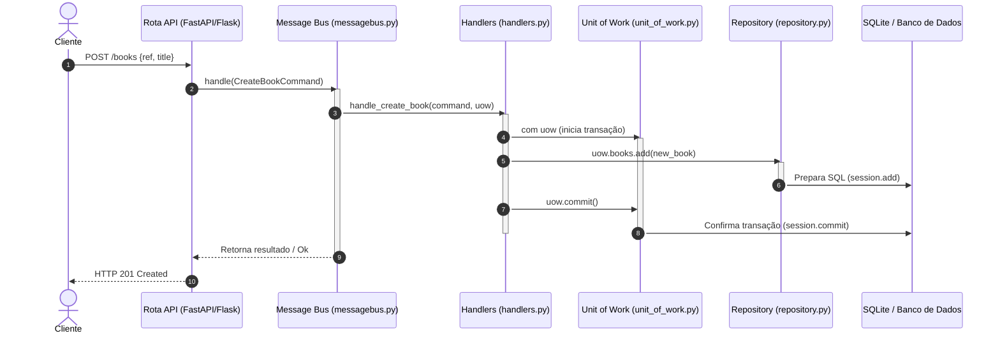

# Guia Definitivo de Estudos: Prova Prática e Arguição de APOO
**Data da Prova: 02/06**  
*Foco: Arquitetura em Python (Domain-Driven Design, SOLID, Padrões de Arquitetura e CQRS)*

---

## 1. Fluxo de Execução da Aplicação (Arquitetura)

Antes de memorizar os termos, compreenda o caminho de uma requisição HTTP pela arquitetura. Abaixo está o fluxo completo quando um cliente envia, por exemplo, um `POST /books`:



---

## 2. Perguntas e Respostas da Arguição (50% da Nota)

As perguntas da arguição serão feitas individualmente a cada membro da dupla. Estude as seguintes respostas conceituais:

### Q1: O que é o Domain Model (domain.py) e por que ele deve ser isolado?
*   **Resposta:** O Domain Model representa o coração da aplicação, contendo as regras e a lógica de negócio (ex: validar se um item pode ser alocado, lançar erro se saldo for insuficiente). Ele é modelado usando classes Python puras (POPO - *Plain Old Python Objects*), sem herdar nada de frameworks ou bibliotecas de banco de dados (como o SQLAlchemy).
*   **Por que isolar?** Para respeitar o **DIP (Princípio da Inversão de Dependência)** e garantir testabilidade. Se o domínio não depende do banco de dados, podemos escrever testes de unidade puros, rápidos e que rodam em milissegundos sem precisar subir conexões de rede ou criar tabelas temporárias.

### Q2: Qual a diferença entre Entidades (Entities) e Objetos de Valor (Value Objects)?
*   **Entities (Entidades):** Objetos que têm uma identidade única que persiste ao longo do tempo, mesmo se outros atributos mudarem. Nós nos importamos em distinguir uma entidade de outra (ex: um `Cliente` com CPF `123`, ou um `Pedido` com ID `99`).
*   **Value Objects (Objetos de Valor):** Objetos definidos exclusivamente pelos dados que possuem, sem identidade individual. Se dois objetos têm os mesmos valores, eles são considerados idênticos. São imutáveis (ex: uma cor `Vermelho`, uma quantia `R$ 50.00`, ou uma classe `Endereco`). Em Python, são facilmente representados usando `@dataclass(frozen=True)`.

### Q3: O que é um Agregado (Aggregate)?
*   **Resposta:** Um agregado é um grupo de objetos do domínio (entidades e objetos de valor) que são tratados como uma unidade única para fins de consistência e alteração de dados. Todo agregado possui uma entidade raiz (o **Aggregate Root**). Qualquer alteração no agregado deve passar obrigatoriamente pela raiz.
*   **Exemplo:** Um `Pedido` é um Aggregate Root, e os seus `ItensDePedido` pertencem ao agregado. Você nunca altera ou adiciona um item diretamente no banco; você chama o método `pedido.adicionar_item(item)`.

### Q4: Para que serve o Repository Pattern (repository.py)?
*   **Resposta:** Serve como uma abstração sobre o banco de dados. Ele finge que todas as instâncias do nosso modelo de domínio estão armazenadas em uma coleção em memória (como uma lista Python).
*   **Interface (DIP):** Definimos uma classe abstrata `AbstractRepository` com métodos como `add()` e `get()`. As rotas ou handlers dependem apenas desta abstração. A classe concreta (`SqlAlchemyRepository`) implementa a lógica real do SQLAlchemy/SQL. Isso permite trocar o banco de dados facilmente (ou usar um repositório fake nos testes) sem alterar a regra de negócio.

### Q5: O que é e qual o papel do Unit of Work (unit_of_work.py)?
*   **Resposta:** O Unit of Work (UOW) é responsável por manter o controle das transações do banco de dados de maneira atômica (tudo ou nada) durante um caso de uso. Ele implementa o padrão *Context Manager* do Python (`with uow:`).
*   **Como funciona:** Ele fornece acesso aos repositórios. Quando o caso de uso termina com sucesso, chamamos `uow.commit()`. Se ocorrer alguma exceção dentro do bloco `with`, o UOW executa o `rollback()` automaticamente no método `__exit__`, garantindo que o banco de dados nunca fique em estado inconsistente.

### Q6: Qual a diferença entre Commands (Comandos) e Events (Eventos) em messages.py?
*   **Commands (Comandos):** Representam uma intenção ou uma ordem expressa para que o sistema realize uma ação (ex: `CreateProduct`, `AllocateStock`). Eles são enviados por um ator (ex: interface web) e possuem apenas **um** destinatário (handler). Podem falhar se as regras de negócio não forem satisfeitas.
*   **Events (Eventos):** Representam fatos históricos que já aconteceram no sistema (ex: `ProductOutOfStock`, `OrderShipped`). São nomeados no passado. Eles são publicados e podem ser ouvidos por **múltiplos** manipuladores para executar tarefas secundárias (ex: disparar um e-mail de aviso, atualizar um log).

### Q7: O que é o Message Bus (messagebus.py) e o que são os Handlers (handlers.py)?
*   **Message Bus:** É o despachante central. Ele recebe uma mensagem (seja Comando ou Evento) e a roteia para o Handler correto.
*   **Handlers (Manipuladores):** São as funções ou classes na camada de serviço que contêm a lógica de orquestração do caso de uso. O handler recebe o comando, inicia o UOW, chama as operações de domínio, persiste no repositório e faz o commit.

### Q8: O que é o Read Model (read_model.py) e a separação de CQRS?
*   **Resposta:** O CQRS (*Command Query Responsibility Segregation*) separa as operações de escrita (comandos que alteram dados) das operações de leitura (consultas que apenas exibem dados).
*   **Write Model:** Passa por toda a arquitetura pesada (Domain, UOW, Repository) para garantir que as regras de negócio complexas sejam validadas.
*   **Read Model (`read_model.py`):** É otimizado para consultas rápidas (`GET`). Ele geralmente executa uma consulta SQL bruta direta no banco para retornar os dados no formato que a tela precisa, sem instanciar classes de domínio ou carregar agregados complexos.

---

## 3. Guia de Scripts de Teste da API (35% da Nota)

Você precisará testar 5 cenários distintos usando requisições HTTP na máquina da apresentação. Abaixo estão os comandos em **PowerShell** estruturados para simular esses testes de forma limpa.

> [!NOTE]
> Ajuste a URL `http://localhost:8000` e os nomes das rotas/atributos conforme o projeto sorteado no dia.

### 1. Teste POST (Criar um recurso)
Criação de um novo elemento no banco de dados.
```powershell
# PowerShell
$body = @{
    ref = "REF123"
    title = "Livro de UML Prático"
} | ConvertTo-Json

Invoke-RestMethod -Uri "http://localhost:8000/books" -Method Post -Body $body -ContentType "application/json"
```

### 2. Teste GET (Buscar todos os recursos)
Listagem completa.
```powershell
# PowerShell
Invoke-RestMethod -Uri "http://localhost:8000/books" -Method Get
```

### 3. Teste GET com Filtro
Buscar um item específico ou filtrar por query parameters.
```powershell
# PowerShell
# Opção A: Filtro na URL
Invoke-RestMethod -Uri "http://localhost:8000/books/REF123" -Method Get

# Opção B: Query parameter
Invoke-RestMethod -Uri "http://localhost:8000/books?title=UML" -Method Get
```

### 4. Teste PUT (Atualizar um recurso)
Modificação de um item existente.
```powershell
# PowerShell
$updateBody = @{
    title = "Livro de UML Prático - Edição Revisada"
} | ConvertTo-Json

Invoke-RestMethod -Uri "http://localhost:8000/books/REF123" -Method Put -Body $updateBody -ContentType "application/json"
```

### 5. Teste de Erro (Regra de negócio inválida)
Testar se a API valida regras de domínio e retorna o status HTTP correto (ex: `400 Bad Request`).
```powershell
# Exemplo: Tentar cadastrar um livro sem título ou com ID duplicado
$errorBody = @{
    ref = "REF123"  # ID que já existe para forçar o erro
    title = ""
} | ConvertTo-Json

try {
    Invoke-RestMethod -Uri "http://localhost:8000/books" -Method Post -Body $errorBody -ContentType "application/json"
} catch {
    # Exibe o código HTTP e a mensagem de erro retornada pela API
    $_.Exception.Response
    $streamReader = New-Object System.IO.StreamReader($_.Exception.Response.GetResponseStream())
    $streamReader.ReadToEnd()
}
```

---

## 4. Estrutura de Testes Automatizados (15% da Nota)

Para obter os 15% correspondentes aos testes, a suite de testes deve rodar sem erros. Ela geralmente é dividida em três níveis:

```
tests/
├── unit/            # Testes rápidos de negócio puros (ex: domain)
├── integration/     # Testes das portas e adaptadores usando repositórios fake
└── e2e/             # Testes de ponta a ponta que fazem chamadas HTTP reais na API
```

### Exemplo de Teste de Domínio Puro (`test_domain.py`):
```python
def test_cannot_allocate_more_items_than_available_stock():
    # Arrange (Configura)
    batch = Batch("batch-01", "RETRO-CLOCK", qty=10)
    line = OrderLine("order-1", "RETRO-CLOCK", qty=12)
    
    # Act & Assert (Executa e Valida)
    assert batch.can_allocate(line) is False
```

### Exemplo de Teste usando Repositório Fake (`test_services.py`):
```python
class FakeRepository(AbstractRepository):
    def __init__(self, books):
        self._books = set(books)

    def add(self, book):
        self._books.add(book)

    def get(self, ref):
        return next((b for b in self._books if b.ref == ref), None)

def test_add_book_service():
    repo = FakeRepository([])
    uow = FakeUnitOfWork(repo) # Implementa commit/rollback falsos
    
    # Executa o handler diretamente sem subir API ou Banco de Dados
    handle_create_book(CreateBook(ref="REF1", title="DDD"), uow)
    
    assert uow.committed is True
    assert uow.books.get("REF1") is not None
```

---

## 5. Checklist para os primeiros 10 minutos de Prova (Semana 17)

Ao entrar na sala de computadores, siga este roteiro de forma disciplinada para evitar perda de tempo:

1.  **Acesso ao GitHub**: Faça login na sua conta no navegador do laboratório.
2.  **Clone o Projeto**: Clone o repositório que a dupla criou previamente.
3.  **Compartilhamento**: Verifique se o seu parceiro de dupla tem permissão de escrita no repositório.
4.  **Configuração do Ambiente Virtual (venv)**:
    ```bash
    python -m venv venv
    .\venv\Scripts\Activate.ps1
    pip install -r requirements.txt
    ```
5.  **Executar Testes Iniciais**: Verifique se os testes já passam no computador do laboratório rodando `pytest`.
6.  **Inicializar o Banco de Dados**: Se aplicável, execute o script para gerar o banco SQLite local (`db.sqlite`).
7.  **Subir Servidor**: Execute o servidor da API (ex: `uvicorn main:app --reload` ou similar) e certifique-se de que a porta não está ocupada.
